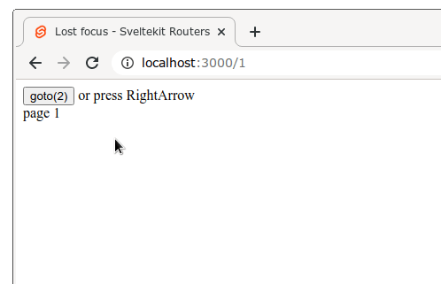

# focus-button

## Run

```bash
git clone git@github.com:lukaszpolowczyk/focus-button.git
cd focus-button
npm run dev
```

Open url: [http://localhost:3000/1]

## Problem

1. Refresh page
2. Press `Tab key` on the keyboard
3. The button are focused
4. Press `Right Arrow` on the keyboard
5. The button loses focus
 
**Question:** How to keep focus?

GIF with this:



The code looks like this:

```svelte
<!-- src/routers/[slug].svelte -->
<svelte:head><title>Lost focus - Sveltekit Routers</title></svelte:head>
<script>
  import { page } from '$app/stores';
  
</script>
<br>
page {$page.params.slug}
```
　
```svelte
<!-- src/routers/$layout.svelte -->
<script>
  import { page } from '$app/stores';
  import { goto } from '$app/navigation';
  
  import Keydown from "svelte-keydown";
</script>
<Keydown on:ArrowRight={() => goto(`${Number($page.params.slug)+1}`) } />

<button on:click={()=>goto(`${Number($page.params.slug)+1}`)}>goto({Number($page.params.slug)+1})</button>
or press RightArrow
<slot />
```
